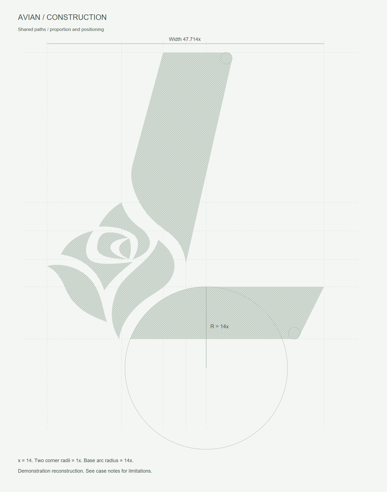

# LSF｜Logo 几何规整与标准制图

给用 AI Web Coding 做个人小产品、网页和原型的人，提供一套 Logo 辅助流程：**先探索、再选择，再把图形规整成可编辑 SVG 和标准制图。**

也可以上传已有 Logo 或草图，直接开始规整。这里开源的是 Skill 指令、方法资料和辅助脚本，调用时由 Codex 理解图片并执行，不是一个上传后必定自动完成的独立软件。

[安装与使用](docs/install.md) · [案例详情](gallery/README.md) · [常用指令](docs/prompts.md) · [视频演示稿](docs/video-script.md) · [下载 Skill](https://github.com/leishifu666/lsf-logo-geometry-system/releases/latest) · [源码许可](LICENSE)

## 适合谁，能做到哪一步

适合个人工具、项目落地页和早期原型：尝试图形方向，挑选与页面风格相合的方案，再输出方便放进网页的文件。配合合适的尺寸和留白，可以改善页面的视觉完整度；效果仍取决于选图和页面搭配。

| 优点 | 局限 |
|---|---|
| 将概念探索、选择、规整和导出连成一个流程 | 生成结果不稳定，可能不好看或元素拼合生硬，需要人工筛选和多轮修改 |
| 简单几何图形可统一直边、圆角和间距，输出可编辑路径 | 复杂插画、自由曲线、精细字标和光学校正更难处理，不能保证所有输入都能规整好 |
| 可以接到网页开发里继续改色、调尺寸和检查实际效果 | 需要可用的模型与工具环境，可能消耗额度；没有实际应用检查就不能当作定稿 |

**它不能独立完成专业品牌设计项目。** 品牌定位、差异化判断、整套视觉识别系统、多场景应用测试和权利核查，都不由一张Logo和一套参考线解决。设计师可以把它当探索或制作辅助；不应把输出当成已经完成的品牌方案。

## 网站 Logo 为什么常选 SVG

简单、轮廓清晰的Logo常适合用纯矢量SVG：路径随显示尺寸重新渲染，方便在不同尺寸和高像素密度屏幕使用；还可以继续编辑轮廓和颜色。内联SVG可用页面CSS控制路径颜色，适配深浅主题。简单图形通常较紧凑，但复杂路径的SVG也可能更大、更耗渲染资源。[MDN：网页中的矢量图](https://developer.mozilla.org/en-US/docs/Learn_web_development/Core/Structuring_content/Including_vector_graphics_in_HTML)

PNG同样支持透明，分辨率足够时也能清晰显示；它适合纹理效果、固定尺寸交付或仅接受位图的上传入口。SVG和PNG都能在网站使用。SVG不会自动让设计好看，也不会保证缩小后细节可辨；若文件内部嵌的是PNG，它仍受位图分辨率限制。[MDN：SVG中的图片元素](https://developer.mozilla.org/en-US/docs/Web/SVG/Reference/Element/image)

## 看看实际效果

### KUNKUN → 几何规整与字标规范


3个图形部件采用直线与相切圆弧，统一51°主斜边、法向间隙和圆角；K / U / N各使用一套字形，重复字母共用轮廓。这里的数值是本次规整采用的设计参数。

[查看 KUNKUN 案例与文件](gallery/kunkun/README.md) · [成品 SVG](gallery/kunkun/kunkun-regularized.svg) · [B式比例定位图](gallery/kunkun/B-proportion-guides.png)

### 选定概念 → 规整矢量


保留咖啡杯与猫的负形，整理边线和曲线衔接，输出透明图形。DRIP 字形是近似重建；自由曲线保留为 Bézier，不伪装成圆弧。

### 复杂图形 → 标准制图


鸟形案例保留8个独立区域，将两处端部圆角统一为 R=14，下方长弧改为 R=196 的真实圆弧，成品与制图共用几何参数。

<p align="center"></p>

### 没有图形 → 先出探索板

<p align="center"></p>

这是概念选择板，不是24个已验证成品。选择方向后，再处理圆角、负形、曲线和矢量文件。

## 安装

在支持 Skill 的 Codex 环境中发送：

```text
$skill-installer install https://github.com/leishifu666/lsf-logo-geometry-system/tree/main/skills/lsf-logo-geometry-system
```

安装后，在下一轮消息中输入 `$lsf-logo-geometry-system` 调用。没有识别到时，新开任务后再试；仍不成功请看[手动安装与排错](docs/install.md)。

这是第三方 Skill，安装时可以查看仓库中的全部指令和脚本。安装方式参考 [OpenAI Skills 官方仓库](https://github.com/openai/skills#installation)。

## 三种常用入口

| 你现在有什么 | 怎么说 | 得到什么 |
|---|---|---|
| 一个主题，想先选方向 | 先生成24款探索板，等我选定再制图 | Codex 内置生图概念板 |
| 已有 Logo / AI 图片 / 草图 | 保留识别特征，规整并生成标准制图 | SVG、透明 PNG、B式制图、对照和检查说明 |
| 一个明确描述，要直接成稿 | 直接设计一款并完成 SVG 与标准制图 | 单个设计及同源制图 |

```text
$lsf-logo-geometry-system
为猫咪与咖啡融合的咖啡品牌生成一张4列×6行的黑白Logo探索板。
元素自然结合，尽量简约。先让我挑选，不要提前确定最终方案。
```

选中后，上传选中格或说明行列：

```text
$lsf-logo-geometry-system
就用我上传的这款。保留识别特征和负形关系，修正不规则边线与圆角。
输出可编辑SVG、透明PNG、B式标准制图和原图对照。
只有真正参与构造的圆才画进制图，说明主动调整和小尺寸限制。
```

## 使用条件

- 探索板需要当前 Codex 环境提供内置生图工具。Skill 本身不会给环境增加该工具，也不包含模型或额度。
- 内置生图路径不要求另外配置 API key；是否可用以及额度由当前账户和运行环境决定。
- 本地构造脚本使用 Python 3.10+；测量脚本依赖 NumPy 和 Pillow。PNG 渲染可使用环境已有渲染器，附带的 Node 脚本需要 `sharp`。
- 生成不保证一次满意，数量、文字和图形细节也要检查。不同工具环境未逐一验证。

## 这套规则重点管什么

- 区分“逐点保真”和“几何规整”，允许按任务修正生成误差。
- 直线、圆弧和必要的自由曲线各用对应表达；不靠叠一堆圆来制造专业感。
- 保留细小圆角、真实透明负形及开放通道；检查反白与小尺寸。
- 成品、构造线和尺寸共享参数，区分测得值、拟合值和本次设置。

当前案例也有边界：鸟形完整版在测试的256px宽下保留8块实体，32–128px会损失部分细节；DRIP 在24–32px出现负形粘连。**有标准制图，不等于所有尺寸都能用。**

## 文件结构与验证

```text
skills/lsf-logo-geometry-system/  # 真正安装的 Skill
  SKILL.md
  references/                   # 方法、流程、完整探索板提示词
  scripts/                      # 几何构造、制图、测量、渲染
  tests/                        # 工具回归检查
  examples/                     # 合成几何用例
gallery/                        # 实际案例与成品
docs/                           # 安装、使用与演示文档
```

在仓库根目录运行：

```bash
python -m pip install -r skills/lsf-logo-geometry-system/requirements.txt
python -m unittest discover -s skills/lsf-logo-geometry-system/tests -v
```

工具测试验证构造和测量逻辑，不验证每一次 AI 生成的美感。案例的图形检查见各目录中的 `checks.json`。

本次公开版本对应 Skill **1.5**。核心指令和脚本沿用该版本，新增安装文档、案例图库与发布包。MIT 范围与案例素材说明见 [NOTICE](NOTICE.md)。
