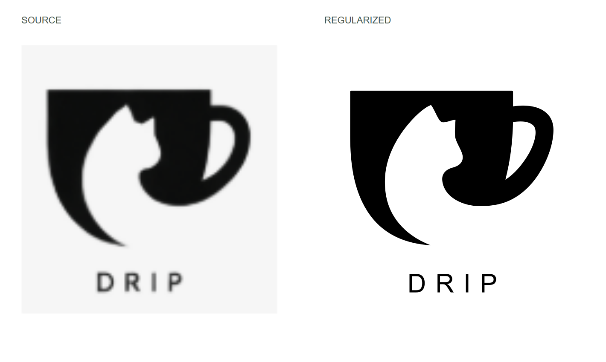
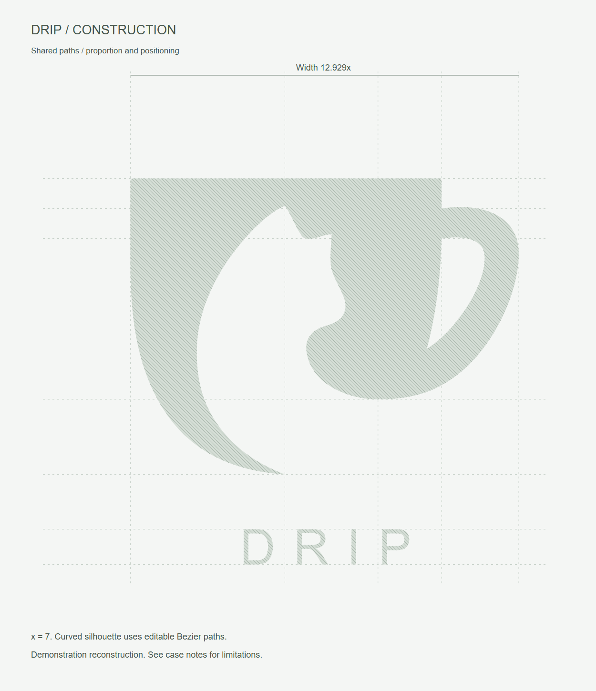
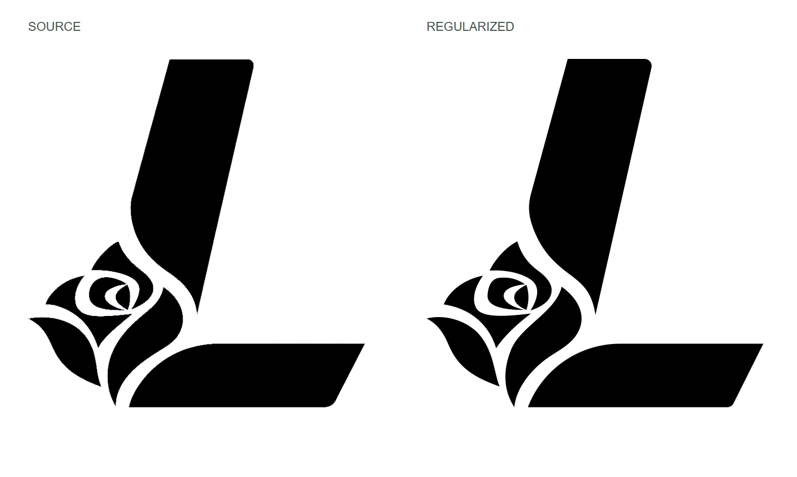
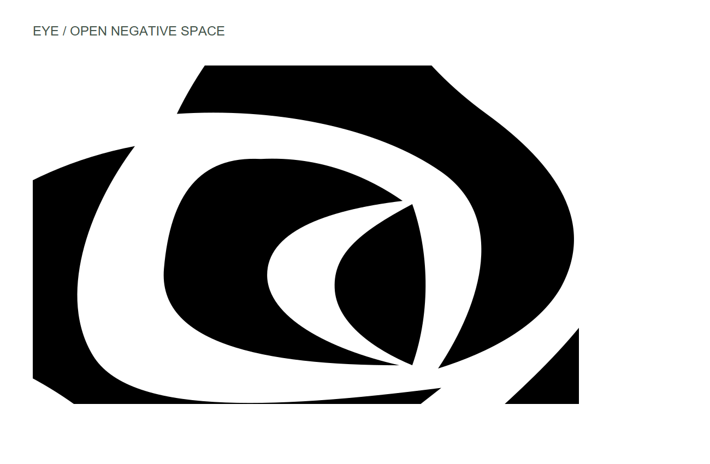
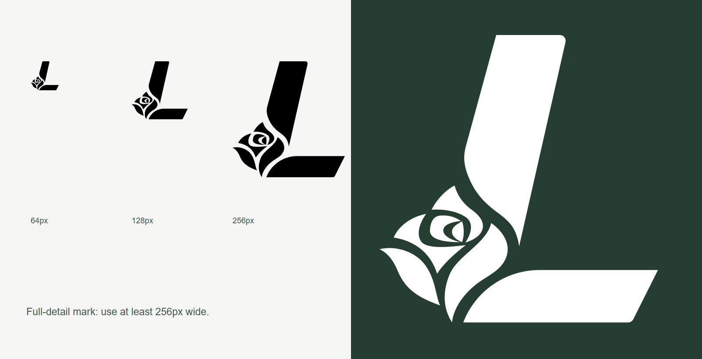
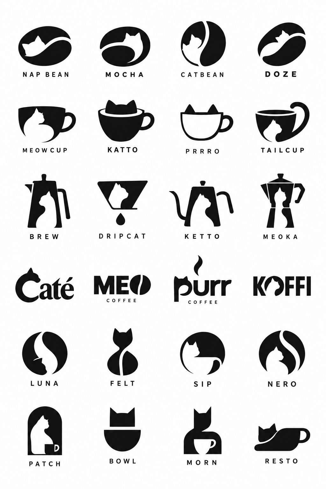

# 案例图库

这些是实际工作流的阶段产物，不代表每次生成都能一次达到相同效果。素材来源与适用范围见 [NOTICE](../NOTICE.md)。

## KUNKUN · 几何规整与字标规范

[案例说明与全部下载](kunkun/README.md) · [成品SVG](kunkun/kunkun-regularized.svg) · [B式比例定位图](kunkun/B-proportion-guides.png) · [A/B对照](kunkun/AB-comparison.png)

保留三个图形部件，规整主斜边、圆弧与间隙；六个字母使用三个标准字形母版。恢复后的9条成品路径及变换与保存的规整稿一致，几何与制图引用检查已重新执行。

## 01 · DRIP 猫咪与咖啡

[原始选图](drip/source.png) · [图形SVG](drip/symbol.svg) · [带字SVG](drip/logo.svg) · [标准制图SVG](drip/construction.svg) · [检查记录](drip/checks.json)

保留猫的负形与杯把孔洞。主轮廓是可编辑自由曲线，顶边是直线；局部圆角R=0.5属于本次设置。原图只有114×120像素，DRIP字形为近似重建。24–32px测试出现额外闭孔，建议图形至少约64px使用。

## 02 · 鸟形图标

[输入图片](avian/source.png) · [成品SVG](avian/logo.svg) · [标准制图SVG](avian/construction.svg) · [检查记录](avian/checks.json)

8个主要黑色区域；两处端部圆角R=14，下方大弧R=196。原图多处轮廓贴边，按可见边界收口，没有恢复画布之外的图形。

256px宽测试保留8个区域，32–128px出现部分细节损失。此例适合展示“发现限制并说明”，不能讲成“小到任何尺寸都不失真”。

## 03 · 猫咪与咖啡探索板

Codex 内置生图生成的4列×6行概念板。英文名字是占位名称，部分格的元素融合仍需改善。此板展示探索模式，DRIP选图另见案例01；不将它们剪辑为同一张板的一次完整生成记录。
