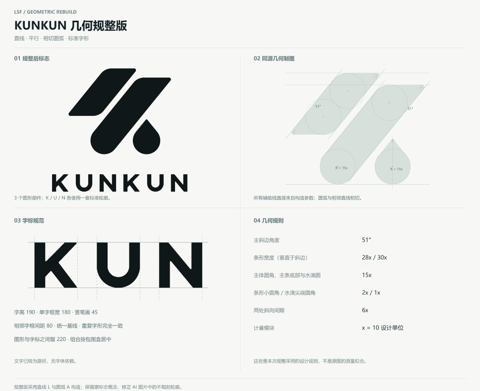
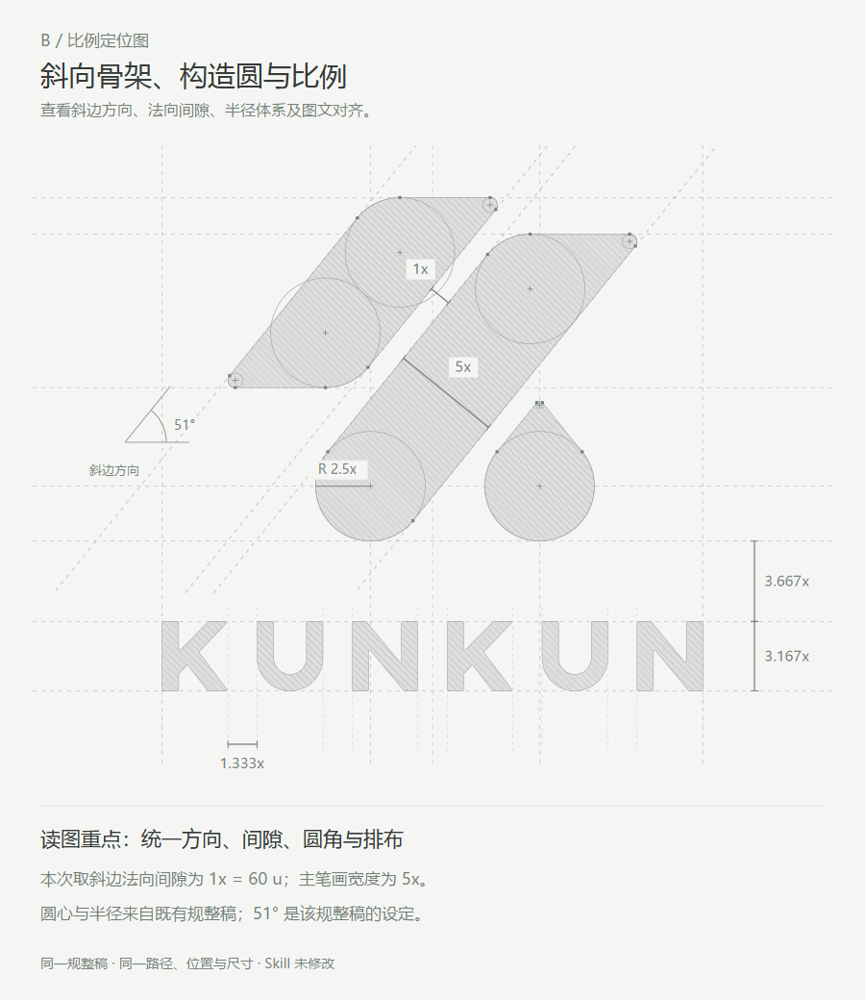

# KUNKUN · 几何规整案例

这是制作过程中确认的KUNKUN规整稿。保留两个斜条和水滴三个部件，使用真实直线、相切圆弧和重复字形母版；没有重新描摹或改变已确认外形。

## 文件

- [原始AI图片](source.png)
- [成品SVG](kunkun-regularized.svg) / [透明PNG](kunkun-regularized.png)
- [独立图形SVG](symbol-regularized.svg) / [字标SVG](wordmark-regularized.svg) / [反白SVG](kunkun-white.svg)
- [几何与字标总览SVG](construction.svg) / [高清PNG](construction.png)
- [B式比例定位SVG](B-proportion-guides.svg) / [PNG](B-proportion-guides.png)
- [A/B制图对比SVG](AB-comparison.svg) / [PNG](AB-comparison.png)
- [原图描摹与规整稿对比](before-after.png)
- [几何参数](geometry.json) / [检查记录](checks.json)

## 采用的规则

主斜边为51°；两条带的法向宽度分别为280、300设计单位；两处法向间隙为60；大圆角、主条底部和水滴主体半径150；小圆角20、水滴尖端圆角10。字高190、字框宽180、相邻字框间距80，图形与字标间距220。

总览图取x=10设计单位，B式图取x=60设计单位（法向间隙）。两张图只是标注模数不同，例如R=15x与R=2.5x都表示150设计单位，成品路径相同。参数属于本次设计设定，不声称从低清AI原图测得。

## 本次恢复与核对

从保存的构造脚本恢复文件，9条成品路径与各自变换逐一匹配保存的规整SVG。重新执行了38项构造残差计算、9段主体圆弧端点与构造圆对应检查、法向宽度与间隙检查，并核对A/B图引用同一成品路径。圆弧端点序列化后的最大半径残差约0.000000445设计单位。

本次没有重新进行小尺寸测试或印刷打样，不据此给出最小使用尺寸。对照图左侧是此前对原图的保真描摹，原始位图另附。用户提供的确认截图单独保存在`approved-overview.png`，高清总览由对应参数重新导出。
